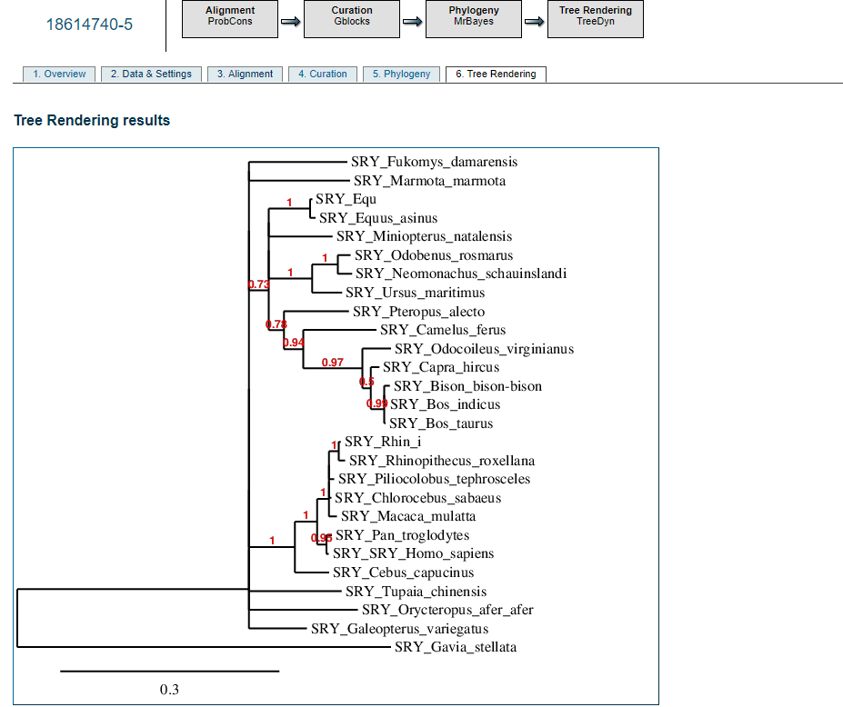
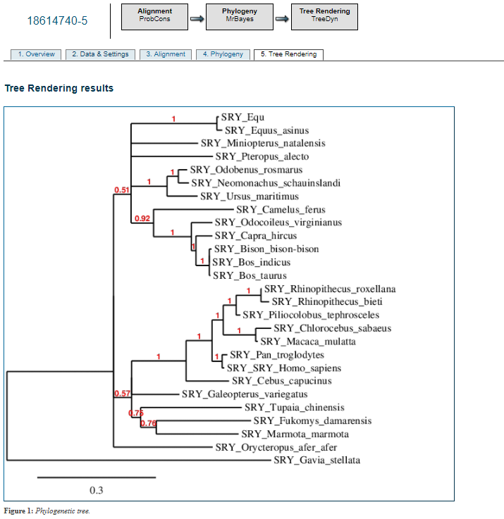
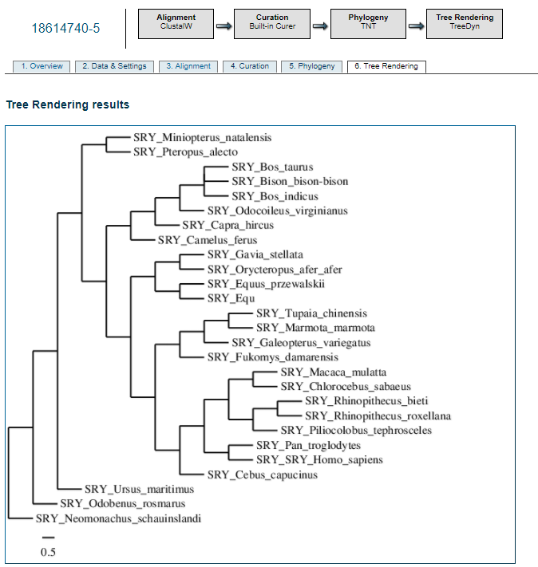
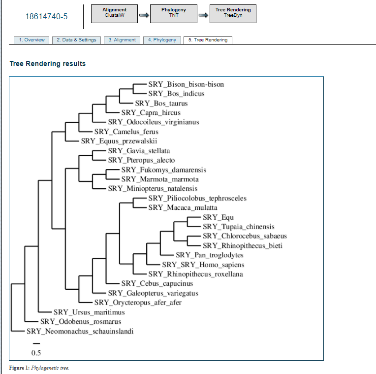

# BIOINF-4

## Parte 1: Filogenética Molecular

__1.¿Qué cosas ofrece este portal?__ Este portal ofrece un amplio contendio de programas para facilitar la construccion de una filogenetica asociada a una o más secuencias, ya que posee alineamientos, construccion de arboles de filogentica, BLAST y muchas otras herramientas. 

__2.¿Para qué tipo de usuario está diseñado?__ Esta pagina web esta diseñada para todo tipo de usuarios, ya que posee la opcion one click que facilita las cosas para los principiantes, pero tambien ofrece soluciones para usarios más avanzados con las opciones de Advanced y a la carte.

__3.Menciona 5 tipos de análsis que se pueden realizar en el portal de acuerdo a la documentación.__

A. BLAST para ver la similaridad entre secuencias

B. Alineamineto de secuencias: nucleotidicas y proteicas

C. Analisis de filogenetica: homologia con otras especies en base a secuencias especificas

D. Construccion de arboles filogenticos.

E. La realizacion de todo lo anterior pero en un solo paso y con los parametros que uno requiera.

4.__¿A qué se refiere el paso de *Alignment curation* y para qué sirve?__  es una utilidad de el complemento a la carte en el cual se borran las secuencias posiblemente erroneas, las 2 formas utilizadas son Gblock el cual elimina secuencias erroneas y regiones divergentes la otra es ''Remove position with gaps'' que elimina los gaps comparando las secuencias más puras, pero con menos alineamiento.

5.__¿Cuál es la diferencia entre BioNJ y Neighbor? (Pista: revisa la documentación)__ el cambio entre BIoNJ y Neighbor BIoNJ esta diseñado para las secuencias de DNA y proteicas este tiene mejor precision en base a la topologia evolutiva, aunque sean distintos los parametros, los arboles son muy cercanos e incluso identicos aveces, sobre todo cuando el numero de datos analisados es bajo "Taxones"
6.__Corre de nuevo las filogenias pero esta vez sin *Alignment curation*. ¿Cuál es el efecto en las filogenias?__ 
En el que se utilizo ProbCons, GBlocks, MrBayes y TreeDyn comparado con el sin GBlocks, hubieron cambios singnificativos en las distancias, pero sin embargo se mantuvieron la mayoria de las posiciones en el arbol, en su contra parte, en el que se utilizo ClustalW,Remove positions with gap, TNT, y TreeDyn comparado con el sin Remove positions with gaps, cambio casi todo posiciones de las especies distnacias, etc.

       Imagen I ProbCons, GBlocks, MrBayes, y TreeDyn.

          Imagen II ProbCons, MrBayes, y TreeDyn.

          Imagen III ClustalW,Remove positions with gap, TNT, y TreeDyn.

          Imagen IV ClustalW, TNT, y TreeDyn.
